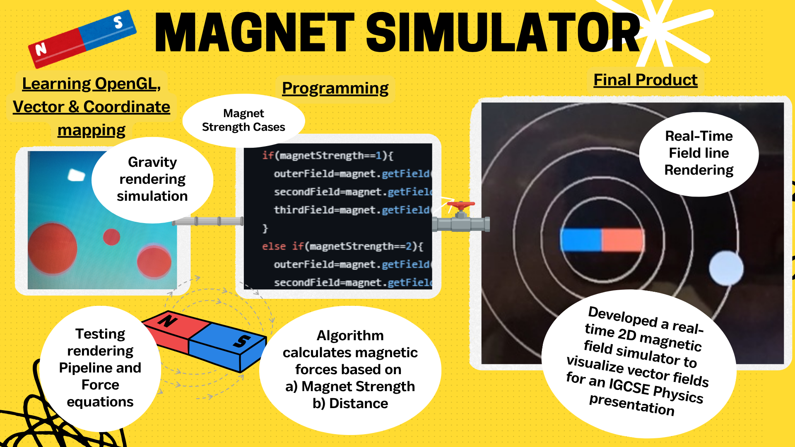

# 2D Magnet Simulator 🧲

## The Process Pipeline

  

## Video of Final Product

## Physics Presentation 🧑‍🏫

My teacher was pleasantly *surprised* when he saw me present my program in class. He took an interest in it and offered to *review* it in his free-time after class, to which he came back happy. Overall, the program was a *success*. ✅

## Interested? 💡

Find out more by following this [link](https://github.com/ArifNaufalMNazri/SimpleMagnetSim) to the full repo, containing the code and full explanation of the process
