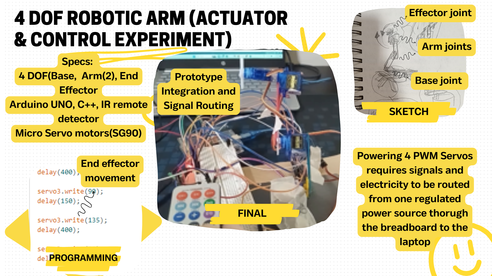

[Back to home](../README.md)

# 4 DOF Robotic Arm 🦾

## Brief Explanation

  

## Video Of Arm

## Bloopers

*Moments before the design fell apart. I had to hold it in place long enough to take a photo.*

## Want to know more? ☁️
Find out more by following this [link](https://github.com/ArifNaufalMNazri/Remote-Controlled-Arduino-Arm/tree/main) to the full repo, containing the *code* and full explanation of the *process*
