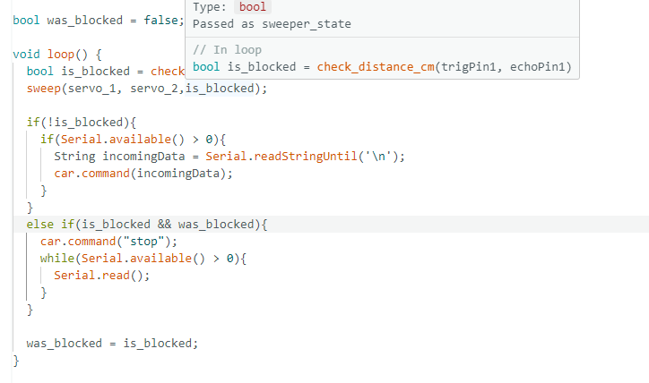
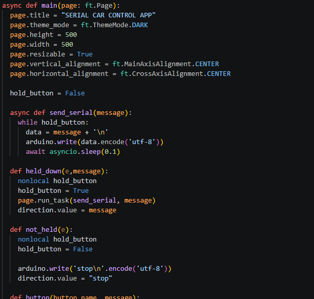
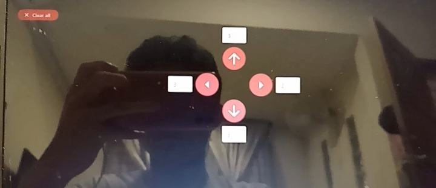
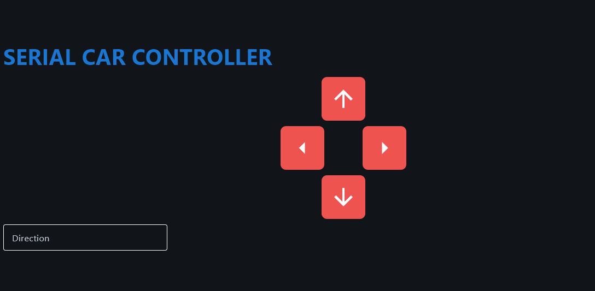
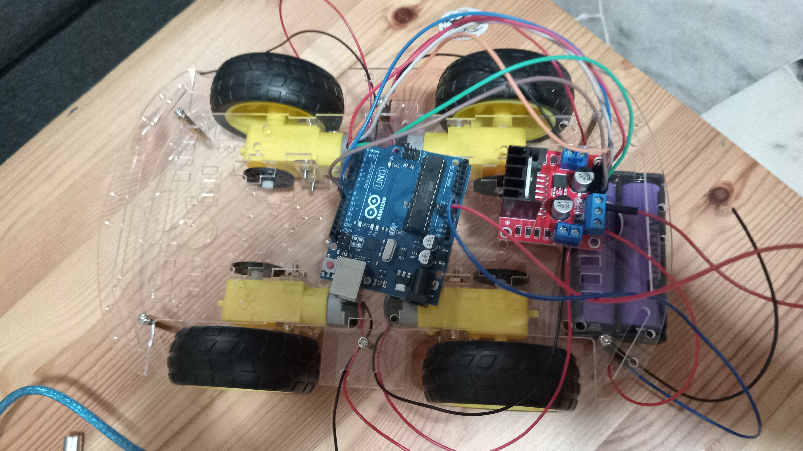

# Flet Arduino Sweeper Car -- Ca-R-oomba 🚓

Click on this [link](https://github.com/ArifNaufalMNazri/Flet-Arduino-Sweeper-Car--Ca-R-oomba) to view the repository on <b>Github</b> for a more in depth breakdown. 👁️

## The Build

 
 <i>After a few weeks of work and code iterations, the car was finally able to detect obstacles and sweep them away</i>

 

## Code and App Screenshots

## The building

