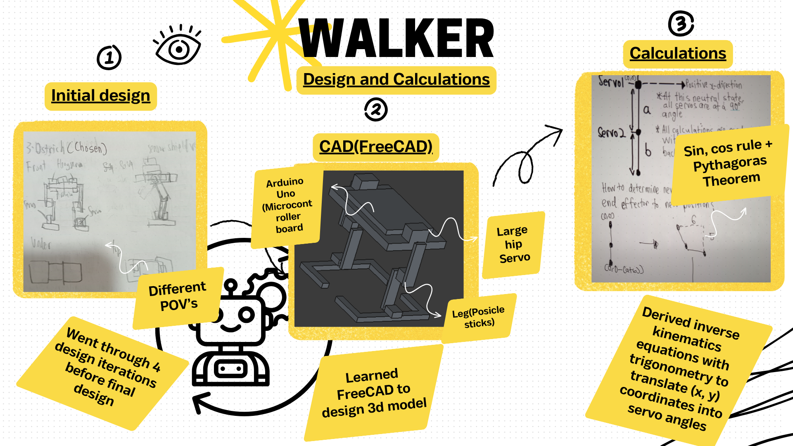
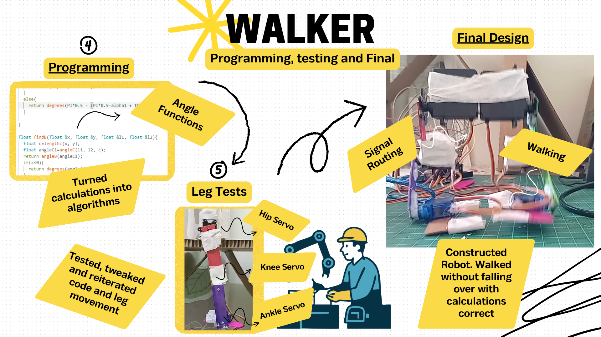

# Walker Robot 🚶

## Phase 1: Design and Calculations

  

>[!TIP]
>Do calculations on a device
>
>Make several designs before committing to one

## Phase 2: Programming, Testing and final 

  

## Video of Walker Walking

## Previous Failures 
At first, the robot always keeled over its own weight, but after altering the weight distribution of the robot, it was able to walk. 

## Like what you see? ❤️
Find out more by following this [link](https://github.com/ArifNaufalMNazri/Walker) to the full repo, containing the *code* and full explanation of the *process*

